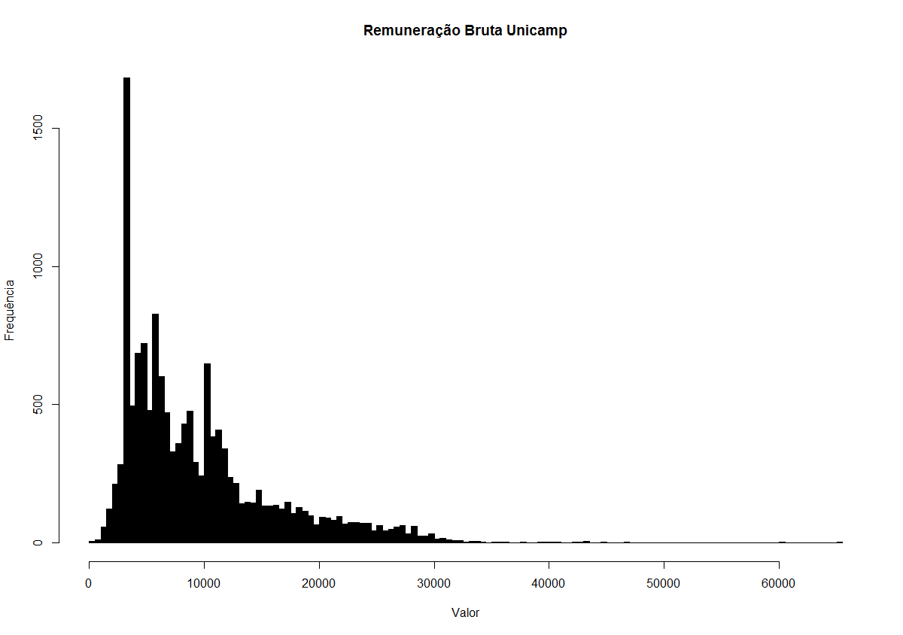

# unicamp-salarios

## Análise da remuneração dos funcionários da Unicamp (junho/2015)

Análise sucinta da [folha de pagamento](http://www.dgrh.unicamp.br/remuneracao.pdf) dos funcionários da Unicamp (junho/2015) usando Python e R.

**Python**: processamento do pdf e dados;
**R**: criação do histograma e análise

**Alguns dados** (valores brutos)

* maior: R$ 65,287.63 (matrícula 76872)
* menor: R$ 408.72 (matrícula 127345)
* acima do teto (R$ 21,631.05): 1020 matrículas / R$ 4,4 milhões (7.21% das matrículas / 3.29% do total da folha de pagamento)
* total dos pagamentos: R$ 134,062,317 (134 milhões)

**Distribuição**

